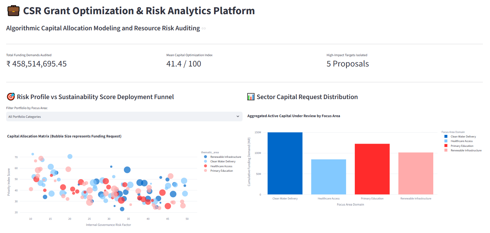
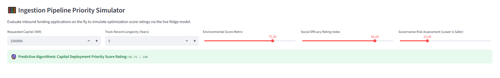

# 💼 CSR Grant Optimization & Risk Analytics Platform

A production-grade algorithmic capital allocation pipeline and risk auditing engine designed to score, filter, and distribute finite organizational budgets across competing public-sector or philanthropic infrastructure applications under complex variable ESG guidelines.

---

## 🏗️ Production Architecture Layout

The platform enforces clean software engineering standards and explicit data separation of concerns:

*   **`data/`** - Sandboxed local SQLite database containing ingested public sector requests. Securely hidden via configuration gates.
*   **`src/`** - Backend logic modules housing database initializations, SQL query builders, and regression model training logic.
*   **`output/`** - Serialized model weights (`.pkl`) decoupled from presentation code execution.
*   **`assets/`** - Embedded interface presentation images.
*   **`app.py`** - Interactive frontend manager layout linking real-time model inferences to active UI controllers.

---

## 🖥️ Platform Interface Preview

### 1. Portfolio Portfolio Allocation Funnel & Sector Analytics


### 2. Live Machine Learning Ingestion Priority Scoring Simulation


---

## ⚙️ Technical Capabilities & Stack

*   **Data Pipelines (SQL):** Formulated relational table structures utilizing `JOIN` logic to merge structural project profiles with operational data vectors.
*   **Algorithmic Allocation Indexing:** Designed custom composite pricing metrics balancing environmental impact and social efficiency yields against strict governance risk ceilings.
*   **Supervised ML Modeling (Ridge Regression):** Implemented regularized linear regression algorithms to mitigate pipeline multi-collinearity and generate live priority coefficient scores.
*   **Data Visualization (Streamlit & Plotly Express):** Rendered non-technical visual controls for corporate impact boards and resource strategists to easily model complex budgeting scenarios.

---

## 🚀 Local Deployment Execution Steps

Ensure your working directory is set to this project folder, then run the commands sequentially:

1. **Install Global Application Libraries:**
   ```powershell
   python -m pip install pandas numpy scikit-learn streamlit plotly
   ```

2. **Initialize and Seed the Optimization Database Matrix:**
   ```powershell
   python -m src.pipeline
   ```

3. **Launch the Real-Time Production UI Server:**
   ```powershell
   python -m streamlit run app.py
   ```
